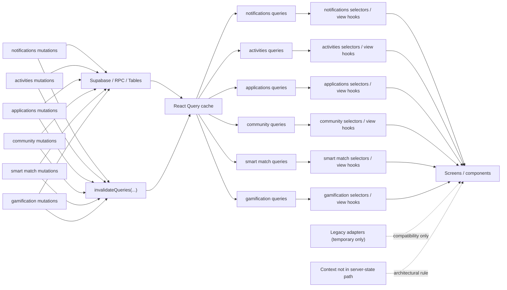

# Server State Migration Plan

Questo documento definisce la convenzione architetturale e il piano operativo per migrare progressivamente lo stato server verso React Query, partendo da `preview` su SDK 54.

## Baseline di partenza

- Branch di lavoro applicativo: `main`
- Baseline `preview` corrente:
  - update group `a71c1862-4f61-4ed2-a5db-c16abaa19ddc`
  - messaggio `Reset preview to SDK54 stable before domain migration`
  - commit `5321f3a`
- Backup Git:
  - `backup-pre-domain-migration-main-2026-04-10`
  - `backup-pre-sdk55-main-2026-04-10`
- Backup database:
  - `backups/prod-schema-2026-04-10.sql`
  - `backups/prod-data-2026-04-10.sql`
  - `backups/staging-schema-2026-04-10.sql`
  - `backups/staging-data-2026-04-10.sql`

## Fase 0: regole comuni

Queste regole vanno applicate prima del primo refactor di dominio.

```ts
// Source of truth rules
// 1. Server state lives in React Query
// 2. Context is only for app orchestration and ephemeral global UI state
// 3. Realtime never writes canonical state into Context
// 4. AsyncStorage never stores canonical backend entities
// 5. Every domain exposes query hooks + mutation hooks
// 6. Realtime defaults to query invalidation, not manual cache patching
// 7. Manual cache patches are allowed only when explicitly justified
// 8. Query keys are centralized per domain and reused everywhere
// 9. Each domain has exactly one source of truth for canonical data
```

## Decisioni operative

- Nessun "Context wrapper di funzioni" se non aggiunge vera orchestrazione.
- Preferire:
  - `keys.ts`
  - `queries.ts`
  - `mutations.ts`
  - `hooks.ts` solo se serve comporre piu hook
- Realtime:
  - default = `invalidateQueries`
  - patch cache solo se c'e un motivo chiaro e documentato
- AsyncStorage:
  - solo preferenze locali
  - draft locali
  - piccoli flag persistenti
  - mai entita backend canoniche

## Convenzione query keys

Le query keys devono essere centralizzate per dominio e riutilizzate ovunque.

Esempio:

```ts
export const notificationKeys = {
  all: ['notifications'] as const,
  list: (userId: string) => [...notificationKeys.all, 'list', userId] as const,
  unreadCount: (userId: string) => [...notificationKeys.all, 'unread-count', userId] as const,
};
```

Regole:

- includere sempre il `userId` quando il dato e user-scoped
- usare key stabili, non oggetti anonimi non normalizzati
- ogni invalidazione deve passare dalle key centralizzate del dominio

## Ordine di migrazione dei domini

1. `notifications`
2. `activities`
3. `applications`
4. `community`
5. `smart match`
6. `gamification`
7. `chat`
8. `altro`

## Done criteria globali

Un dominio si considera migrato quando:

- esiste una sola source of truth per i dati canonici
- il dato canonico vive in React Query
- Context non possiede copie canoniche dello stesso dato
- Realtime non scrive direttamente in Context il dato canonico
- AsyncStorage non salva entita backend canoniche del dominio
- il dominio espone query hooks e mutation hooks coerenti
- i flussi principali sono stati verificati in `preview`

## Preparazione dominio: Smart Match

### Decisione semantica

Per `smart match`, il primo obiettivo non e tecnico ma semantico:

- il dominio `smart match` e la source of truth canonica del ranking e del `match score`
- ranking, sorting, recommendations e decisioning usano solo il match canonico di `smart match`
- `activities` puo esporre solo uno snapshot legacy/UI del match score
- lo snapshot UI non puo essere usato per logica di prodotto

In pratica:

- `match.score` = dato canonico
- `activity.matchPercentage` = snapshot legacy/UI, non canonico
- `get_activities_with_match` = server match input, non score finale del dominio

### Regola temporanea su `activity.matchPercentage`

Finche esiste:

- va trattato come snapshot legacy/UI
- non puo essere usato come base di ranking, sorting o recommendations
- deve essere segnalato nel codice come valore legacy o snapshot, non come score canonico

Obiettivo:

- evitare che un campo activity-side apparentemente innocuo torni a essere riusato come verita del dominio

### Boundary locale accettato

`SmartMatchPreferencesService` resta nel perimetro corretto del dominio se continua a gestire solo:

- preferenze locali persistenti lato device
- dismissals
- filtri locali
- stato UI persistente locale

Non puo contenere:

- entita backend canoniche
- ranking canonico
- match score canonico

### Dataset canonici minimi

Il dominio `smart match` deve esporre almeno:

- `smartMatchKeys.matches(...)`
- `smartMatchKeys.matchActivity(activityId, userId)` oppure lookup equivalente canonico
- eventuali dataset dedicati a `saved` o `hidden` solo se diventano viste di dominio reali

Regola aggiuntiva:

- il dataset canonico deve poter esistere anche senza `Gemma reasons`
- `reason` e `summary` sono enrichment UX, non dipendenze strutturali del ranking

### Entry point critico

`app/(volunteer)/(tabs)/search.tsx` e l'entry point critico del dominio.

Regola:

- `search.tsx` deve leggere il match score da una sola fonte
- nessun fallback permanente tra `activities` e `smart match`
- eventuali fallback transitori vanno marcati come legacy e rimossi durante il refactor del dominio

## Dominio reference: Activities

`activities` e il dominio di riferimento per i refactor successivi.

Il pattern da riusare e:

- query keys centralizzate
- query hooks di dominio
- mutation hooks di dominio
- selector hooks per dati derivati condivisi
- adapter paginato sottile senza stato proprio
- nessun context bridge legacy

In pratica:

- source of truth canonica = React Query
- `useActivities` resta solo un adapter paginato su `useInfiniteQuery`
- il dettaglio usa sempre `useActivityDetailQuery(activityId)` come fonte primaria
- le mutazioni passano solo da hook dedicati e invalidano le query corrette
- nessun Context possiede piu dati activity canonici

## Principi operativi per i domini

### Dato canonico fuori dal Context

Il Context non puo possedere dati canonici backend del dominio.

Per `activities`, questo significa in modo esplicito:

- `ActivityContext` non possiede la lista canonica delle activity
- `ActivityContext` non possiede il detail canonico di una activity
- `ActivityContext` non possiede i participants canonici
- `ActivityContext` non possiede pagination items canonici

Se il Context resta temporaneamente, puo fare solo orchestrazione non canonica:

- trigger UI globali
- side effects coordinati
- compat layer temporaneo dei consumer

Ma non puo diventare una seconda cache del dominio.

### Detail query come fonte primaria

Le schermate dettaglio devono avere una regola netta:

- il detail usa sempre una query dedicata come fonte primaria
- eventuale dato proveniente dalla lista puo essere usato solo come `initialData` o `placeholderData`
- il dato lista non puo restare una seconda source of truth del detail

Per `activities`, questo vale in particolare per:

- `app/activity/[id].tsx`

Quindi:

- `useActivityDetailQuery(activityId)` deve essere la fonte primaria del dettaglio
- eventuale dato gia presente nella lista puo solo migliorare il first paint
- non puo decidere da solo il valore canonico mostrato dalla schermata

### Mutations: una sola scrittura canonica

Le mutazioni non possono aggiornare sia Query sia Context come doppia scrittura canonica.

Regola:

- default = mutation server-side + invalidation query
- patch manuale della cache solo se davvero giustificata
- Context non riceve scritture canoniche dalla mutation

Quindi non sono ammessi pattern del tipo:

- mutation che aggiorna React Query
- e in parallelo `setState` canonico nel Context

Se serve stato locale ottimistico, deve essere:

- esplicito
- limitato
- separato dal dato canonico

## Fase 1: Notifications

### Obiettivo

Spostare la gestione canonica delle notifiche da `NotificationContext` a React Query, mantenendo eventuali effetti UI solo dove servono davvero.

### Target architetturale

- lista notifiche in Query
- unread count in Query o derivato coerente dalla cache Query
- mutation dedicate:
  - `markAsRead`
  - `markAllAsRead`
  - `clearAll`
- realtime usato per invalidare o aggiornare in modo controllato la cache Query
- routing al tap e foreground toast preservati

### Done criteria: Notifications

- nessuna lista notifiche canonica in Context
- nessun unread count canonico duplicato in `useState` separato
- `NotificationContext`, se resta, gestisce solo orchestrazione UI non canonica
- realtime non fa `setState` canonico nel Context
- tutte le query usano query keys centralizzate del dominio
- `AsyncStorage` non contiene notifiche canoniche
- badge, lista e dettaglio risultano coerenti

### Vincolo temporaneo sul NotificationContext

Finche esiste, `NotificationContext` e un bridge temporaneo di UI/orchestration.

- non puo contenere stato canonico delle notifiche
- i dati arrivano solo da React Query
- non puo reintrodurre cache locale duplicata
- puo restare solo per:
  - foreground toast
  - routing al tap
  - bridge Expo push response
  - compatibilita temporanea dei consumer

Quando i consumer saranno migrati ai query/mutation hooks del dominio, `NotificationContext` andra rimosso.

## Preparazione dominio: Activities

### Obiettivo architetturale

- `activities list` in Query
- `activity detail` in Query
- `activity participants` in Query o derivati dalla query detail/list coerente
- `activity applications` in Query
- `reviews` e `volunteer reviews` in Query
- paginazione canonica gestita da Query, non dal Context

### Regole specifiche

- `app/activity/[id].tsx` usa `useActivityDetailQuery(activityId)` come fonte primaria
- il dato proveniente dalla lista puo essere solo `initialData` o `placeholderData`
- `ActivityContext` non puo mantenere fallback locali come fonte primaria del detail
- le mutazioni `create/update/delete/enroll/unenroll/apply/review` non possono scrivere sia su Query sia su Context
- `EventEmitter` e listener equivalenti devono invalidare query, non riscrivere cache canonica nel Context

### Done criteria: Activities

- nessuna lista activity canonica in Context
- nessun detail activity canonico in Context
- nessun participants state canonico in Context
- nessun pagination items state canonico in Context
- `useActivityDetailQuery(activityId)` e la fonte primaria del dettaglio
- create/update/delete/enroll/unenroll/apply/review usano mutation hooks del dominio
- invalidation coerente di:
  - activities list
  - activity detail
  - activity applications
  - reviews
  - volunteer reviews
- nessuna schermata legge una seconda source of truth del detail

### Stato: Activities = Done

Il dominio `activities` e considerato chiuso quando risultano veri tutti questi punti:

- nessun consumer di `ActivityContext`
- nessun provider legacy `ActivityProvider`
- nessuna lista canonica fuori da Query
- paginazione solo via `useActivities`
- mutazioni solo via hook dedicati
- `lint` e `tsc` verdi
- smoke staging `activity-refactor-smoke` verde
- verifica runtime `preview` verde

Nota:

- finche la verifica runtime manuale in `preview` non e conclusa, il dominio e architetturalmente chiuso ma in attesa di validazione finale

### Checklist di verifica: Notifications

- login
- logout
- login con utente diverso
- riapertura app con sessione persistita
- foreground/background
- nuova notifica via realtime
- `mark as read`
- `mark all as read`
- routing corretto su:
  - activity
  - chat
  - candidature
  - profilo NPO
- coerenza tra badge, lista e dettaglio

## Workflow dominio per dominio

Per ogni dominio:

1. creare un tag Git di backup
2. eseguire il refactor su `main`
3. pubblicare un OTA `preview` dedicato
4. verificare il dominio in `preview`
5. eseguire smoke e verifiche disponibili finche il dominio ha tutti i done criteria soddisfatti in `staging/preview`
6. rilasciare lo stesso dominio anche in `production`, mantenendo `prod` allineata a `staging`
7. passare al dominio successivo solo dopo validazione `preview` e promozione `production`

Regola operativa:

- per ogni dominio, quando `staging/preview` ha tutti i done criteria chiusi e tutti i test disponibili sono verdi, il dominio va promosso anche in `production`
- `production` deve restare una fotocopia architetturale di `staging` per tutti i domini gia certificati

## Dominio corrente: Applications

`applications` e il dominio attualmente pronto per la validazione in `preview`.

Motivo:

- aveva un bridge attivo in `ApplicationContext`
- i consumer usavano soprattutto helper di convenienza
- gli stati canonici sono chiari:
  - `PENDING`
  - `APPROVED`
  - `REJECTED`
- il dominio e abbastanza isolato da poter essere migrato senza toccare subito feed/chat

### Obiettivo architetturale

- lista candidature in Query
- selector per:
  - candidature volunteer
  - candidature NPO
  - `hasAppliedToNPO`
- mutazioni dedicate per:
  - apply to NPO
  - approve
  - reject
- nessun dato canonico applicazioni in Context

### Pattern target

- `applicationKeys`
- `queries.ts`
- `mutations.ts`
- `selectors.ts`
- niente `ApplicationContext`

### Cluster consumer principali

- Gruppo A: liste e dashboard NPO
  - [app/(npo)/(tabs)/index.tsx](/Users/francescocavaliere/aiutarsi/app/(npo)/(tabs)/index.tsx)
  - [app/(npo)/(tabs)/volunteers.tsx](/Users/francescocavaliere/aiutarsi/app/(npo)/(tabs)/volunteers.tsx)
  - [app/(npo)/report.tsx](/Users/francescocavaliere/aiutarsi/app/(npo)/report.tsx)
  - [app/(npo)/settings/index.tsx](/Users/francescocavaliere/aiutarsi/app/(npo)/settings/index.tsx)
- Gruppo B: profili e affiliazioni
  - [app/(npo)/volunteer-profile/[id].tsx](/Users/francescocavaliere/aiutarsi/app/(npo)/volunteer-profile/[id].tsx)
  - [app/(volunteer)/(tabs)/profile.tsx](/Users/francescocavaliere/aiutarsi/app/(volunteer)/(tabs)/profile.tsx)
  - [app/npo-profile/[id].tsx](/Users/francescocavaliere/aiutarsi/app/npo-profile/[id].tsx)
- Gruppo C: mutation entry points
  - [app/(volunteer)/review-application.tsx](/Users/francescocavaliere/aiutarsi/app/(volunteer)/review-application.tsx)
  - [app/(npo)/(tabs)/volunteers.tsx](/Users/francescocavaliere/aiutarsi/app/(npo)/(tabs)/volunteers.tsx)
- Gruppo D: derived insights e community
  - [hooks/useNPOInsights.ts](/Users/francescocavaliere/aiutarsi/hooks/useNPOInsights.ts)
  - [components/community/NPOCommunityScreen.tsx](/Users/francescocavaliere/aiutarsi/components/community/NPOCommunityScreen.tsx)
  - [components/community/VolunteerCommunityScreen.tsx](/Users/francescocavaliere/aiutarsi/components/community/VolunteerCommunityScreen.tsx)

### Done criteria: Applications

- nessun consumer legge applicazioni canoniche da `ApplicationContext`
- nessun helper canonico tipo `getVolunteerApplications` o `getNPOApplications` resta nel bridge
- `hasAppliedToNPO` diventa selector puro basato su Query
- mutazioni `apply/approve/reject` usano solo hook dedicati
- nessuna doppia scrittura Query + Context
- `lint` e `tsc` verdi
- smoke staging del dominio verde
- verifica runtime `preview` verde

### Stato: Applications = Architetturalmente pronto

Il dominio `applications` e considerato architetturalmente pronto quando risultano veri tutti questi punti:

- nessun consumer di `ApplicationContext`
- nessun provider legacy `ApplicationProvider`
- nessuna lista canonica candidature fuori da Query
- selector `useNPOApplications`, `useVolunteerApplications` e `useHasAppliedToNPO` usati al posto degli helper del bridge
- mutazioni `apply/approve/reject` passano solo dai mutation hook dedicati
- `lint` e `tsc` verdi
- smoke staging `application-refactor-smoke` verde
- verifica runtime `preview` da completare

### Checklist di verifica: Applications

- lista candidature volunteer coerente
- lista candidature NPO coerente
- `hasAppliedToNPO` coerente tra card, profilo ente e detail
- `apply to NPO`
- `approve`
- `reject`
- coerenza tra dashboard NPO, tab volontari, profilo volunteer e report
- foreground/background
- resume app
- assenza di drift tra query hooks e selector hooks

## Stato: Community = Done

`community` e stato migrato mantenendo `stories` come dominio separato.

Stato attuale:

- nessun `CommunityContext` residuo
- nessun `CommunityProvider` nel layout
- source of truth canonica in React Query
- dataset espliciti:
  - `communityKeys.feed(...)`
  - `communityKeys.activityPosts(activityId)`
  - `communityKeys.post(postId)`
- realtime via invalidation query
- nessun optimistic update canonico per le reactions nel primo pass

### Perimetro del refactor

Dentro questo pass:

- `community_posts`
- feed principale
- feed activity-linked
- create post
- edit post
- delete post
- report post
- reactions
- post detail singolo

Fuori da questo pass:

- `stories`
- story viewer
- create/delete story

### Regole specifiche

- il dominio deve avere dataset espliciti:
  - `communityKeys.feed(...)`
  - `communityKeys.activityPosts(activityId)`
  - `communityKeys.post(postId)`
- il post singolo non puo essere letto cercandolo nel feed come fonte primaria
- `selectors.ts` contiene solo trasformazioni pure e leggere
- la composizione screen-specifica va in view hooks dedicati
- nel primo pass `toggleReaction` usa mutation + invalidation
- nel primo pass non si usa optimistic update canonico sul feed

### Cluster consumer principali

- Gruppo A: feed/list consumers
  - [app/(volunteer)/(tabs)/community.tsx](/Users/francescocavaliere/aiutarsi/app/(volunteer)/(tabs)/community.tsx)
  - [components/community/NPOCommunityScreen.tsx](/Users/francescocavaliere/aiutarsi/components/community/NPOCommunityScreen.tsx)
  - [components/community/VolunteerCommunityScreen.tsx](/Users/francescocavaliere/aiutarsi/components/community/VolunteerCommunityScreen.tsx)
- Gruppo B: mutation entry points
  - [app/community/create-post.tsx](/Users/francescocavaliere/aiutarsi/app/community/create-post.tsx)

## Preparazione dominio: Gamification

Per `gamification`, la semantica canonica va fissata prima del refactor tecnico.

Il rischio principale del dominio oggi non e il Context in se, ma la doppia lettura tra:

- `gamification_state`
- snapshot profile-side come `profiles.impact_points`, `user.xp`, `user.badges`

Se questa ambiguita non viene chiusa a monte, il refactor rischia di spostare il problema senza eliminarlo.

### Canonical semantics

Questa sezione e bloccante prima di:

- freeze del Context
- creazione del dominio Query
- migrazione dei consumer
- smoke staging del dominio

### Canonical dataset contract

`gamification_state` e l'unico dataset canonico letto dai consumer del dominio.

Regole:

- ogni altro campo profile-side e solo snapshot di compatibilita
- i selector canonici accettano solo input dal dataset canonico
- nessun selector canonico puo accettare sia `gamification_state` sia `AppUser`
- nessun componente core puo leggere direttamente snapshot legacy per decidere XP, livello, badge o progressi canonici

#### Source of truth canonica

La source of truth canonica del dominio `gamification` e:

- `public.gamification_state`

Il dominio deve leggere da li tutti i dati canonici di:

- XP
- livello
- badge
- progress counters persistiti
- milestone history
- threshold o stati persistiti gia materializzati lato DB

#### Campi canonici del dominio

I campi canonici del dominio sono:

- `xp`
- `level`
- `badges`
- `completed_activities_count`
- `processed_activity_ids`
- `shared_activity_ids`
- `enrolled_npo_ids`
- `claimed_milestones`
- `followed_npos_history`
- `total_hours`
- `completed_categories`
- `completion_dates`
- `reviewed_npo_ids`

Derived view fields ammessi:

- `levelName` se derivato da `level`
- `levelProgress`
- `xpInLevel`
- `xpNeededForLevel`

Questi campi non sono canonici come persistenza, ma possono essere una view derivata canonica del dominio se calcolati in selector puri a partire da `gamification_state`.

Quindi:

- non sono source of truth persistita
- ma sono output corretti e canonici del dominio verso la UI

#### Snapshot legacy / non canonici

Questi campi non sono canonici per il dominio:

- `profiles.impact_points`
- `AppUser.xp`
- `AppUser.impactPoints`
- `AppUser.badges`

Sono ammessi solo come:

- snapshot legacy/UI
- compatibilita temporanea
- safety net transitoria

Non possono essere usati per:

- ranking di livello
- badge progress
- progress bar
- report canonici
- decisioni di prodotto

#### Fallback policy

Regola netta:

- fallback legacy consentiti solo come temporary safety net
- vietati nei selector canonici
- vietati nei componenti core del dominio
- ammessi solo in adapter transitori esplicitamente marcati come legacy

Ogni fallback legacy deve avere:

- owner
- perimetro esplicito
- target di rimozione nel piano

In particolare:

- `profiles.impact_points`, `user.xp` e `user.badges` non possono apparire nei selector canonici del dominio
- non possono guidare `ProfileStats`, `BadgeSection`, `VolunteerProfile` o report canonici
- se servono in transizione, vanno incapsulati in un adapter legacy nominato come tale

### Obiettivo architetturale

- server state canonico in React Query
- selectors/view hooks per progress e badge view
- mutation hook dedicato per `record_activity_share`
- nessun dato canonico di gamification nel Context
- eventuale UI state del level-up separato dal server state canonico

### Pattern target

- `gamificationKeys`
- `queries.ts`
- `mutations.ts`
- `selectors.ts`
- eventuale `useGamificationView.ts`

Il Context:

- non puo possedere `xp`, `level`, `badges` o contatori canonici
- non puo piu fare fetch canonica del dominio
- non puo piu fare refetch del dominio
- non puo guidare invalidation business del dominio
- puo al massimo sopravvivere solo come bridge UI temporaneo per il level-up modal
- se il modal viene isolato bene, `GamificationContext` deve sparire del tutto

### Cluster consumer principali

- Gruppo A: core state readers
  - [app/(volunteer)/(tabs)/profile.tsx](/Users/francescocavaliere/aiutarsi/app/(volunteer)/(tabs)/profile.tsx)
  - [components/profile/BadgeSection.tsx](/Users/francescocavaliere/aiutarsi/components/profile/BadgeSection.tsx)
  - [components/profile/ProfileStats.tsx](/Users/francescocavaliere/aiutarsi/components/profile/ProfileStats.tsx)
  - [components/VolunteerProfileView.tsx](/Users/francescocavaliere/aiutarsi/components/VolunteerProfileView.tsx)
- Gruppo B: UI-only transient consumer
  - [components/LevelUpOverlay.tsx](/Users/francescocavaliere/aiutarsi/components/LevelUpOverlay.tsx)
- Gruppo C: business action entry point
  - [app/activity/[id].tsx](/Users/francescocavaliere/aiutarsi/app/activity/[id].tsx)
- Gruppo D: legacy snapshot readers outside the domain
  - [services/VolunteerReportService.ts](/Users/francescocavaliere/aiutarsi/services/VolunteerReportService.ts)
  - punti di shaping in [services/AuthService.ts](/Users/francescocavaliere/aiutarsi/services/AuthService.ts)

### Gap e bug potenziali

1. Doppia fonte di verita per XP e livello

- `gamification_state` e canonico
- ma profile snapshot e `AppUser` espongono ancora campi simili
- rischio di drift tra profile, report e badge progress

2. Fallback troppo comodi

- il fallback profile-side puo restare nel codice molto piu del dovuto
- se entra nei selector canonici, il dominio torna ambiguo

3. Context ibrido data + UI

- oggi `GamificationContext` mischia fetch canonica e `levelUpData`
- rischio: tenerlo vivo per comodita anche quando il server state e gia uscito

4. Progresso badge ricostruito client-side

- [components/profile/BadgeSection.tsx](/Users/francescocavaliere/aiutarsi/components/profile/BadgeSection.tsx) ricalcola parti del progresso
- va chiarito cosa e canonico nel DB e cosa e solo derivazione UI

5. Mutation business nel Context

- `handleActivityShare` oggi vive nel Context
- deve diventare mutation hook con invalidation standard

6. Legacy snapshot sparsi

- il legacy profile-side va confinato in pochi adapter espliciti
- non deve restare distribuito tra componenti, services e selector

### Ordine di implementazione

1. scrivere e fissare `Canonical semantics`
2. freeze di `GamificationContext`
3. creare il dominio Query `gamification`
4. migrare i reader core:
   - `VolunteerProfile`
   - `BadgeSection`
   - `ProfileStats`
5. migrare `record_activity_share` a mutation hook
6. isolare il level-up modal come UI orchestration separata
7. eliminare o ridurre al minimo `GamificationContext`
8. introdurre adapter legacy espliciti e confinati, ad esempio:
   - `getLegacyImpactPointsSnapshot(...)`
   - eventuale shaping profile-side marcato legacy
9. ripulire i legacy snapshot readers fuori dominio
9. smoke staging del dominio
10. OTA `preview`
11. promozione `production` dopo tutti i bollini verdi

### Done criteria: Gamification

- `gamification_state` e l'unica source of truth canonica per il dominio
- nessun selector canonico legge `profiles.impact_points`, `user.xp` o `user.badges`
- `GamificationContext` non possiede piu server state canonico
- `record_activity_share` passa da mutation hook dedicato
- `BadgeSection`, `ProfileStats` e `VolunteerProfile` leggono dal dominio Query
- `LevelUpOverlay` usa solo stato UI transitorio
- fallback legacy, se presenti, sono confinati in adapter transitori marcati
- nessun componente core importa direttamente `GamificationContext`
- nessun componente core legge `AppUser.xp`, `AppUser.badges` o `profiles.impact_points`
- nessun file fuori dagli adapter legacy usa snapshot profile-side per ranking, gating o reporting canonico
- `lint` e `tsc` verdi
- smoke staging del dominio verde
- verifica runtime `preview` verde
- promozione `production` completata

### Runtime checklist: Gamification

Questa checklist va eseguita in due livelli.

#### Livello 1: automatico

Da chiudere prima della `preview`:

- smoke staging del dominio:
  - `state_consistency`
  - `share_invalidation`
- contratto locale anti-regressione:
  - nessun componente core importa `GamificationContext`
  - nessun componente core legge `AppUser.xp`, `AppUser.badges`, `profiles.impact_points`
  - il report volunteer usa `gamification_state` come input canonico
  - i derived view fields (`levelName`, `levelProgress`, `xpInLevel`, `xpNeededForLevel`) derivano solo dal dataset canonico
- `lint`
- `tsc`

Questi check devono coprire in automatico:

- profile volunteer mostra XP/level coerenti a livello di contratto dati
- badge section usa il dataset canonico anche dopo refetch/cold data reload
- profile stats e report non ricadono sugli snapshot legacy dopo login/logout
- activity share invalida e aggiorna lo stato gamification canonico
- nessuna regressione di codice sulle schermate che dipendevano dal Context
- nessun fallback legacy visibile nel codice dei consumer core in condizioni normali

#### Livello 2: manuale mirato in preview

Resta da verificare manualmente solo cio che non e affidabile senza emulator/UI automation:

- profile volunteer mostra XP/level coerenti visivamente
- badge section coerente dopo cold refresh reale dell'app
- profile stats coerenti dopo login/logout reale
- level-up overlay appare una sola volta quando atteso
- nessun fallback legacy visibile all'utente in condizioni normali

Regola:

- se il Livello 1 non e tutto verde, non si pubblica `preview`
- se il Livello 2 non e verde, non si promuove in `production`
  - [components/CommunityPostCard.tsx](/Users/francescocavaliere/aiutarsi/components/CommunityPostCard.tsx)
- Gruppo C: activity-linked reads
  - [app/activity/[id].tsx](/Users/francescocavaliere/aiutarsi/app/activity/[id].tsx)
- Gruppo D: boundaries da lasciare fuori per ora
  - [context/StoriesContext.tsx](/Users/francescocavaliere/aiutarsi/context/StoriesContext.tsx)
  - [components/community/CommunityStoryViewer.tsx](/Users/francescocavaliere/aiutarsi/components/community/CommunityStoryViewer.tsx)

### Done criteria: Community

- nessun consumer legge post canonici da un bridge legacy
- nessun `CommunityContext`
- nessun `CommunityProvider`
- feed, activity posts e post detail hanno query dedicate
- `create/edit/delete/report/reaction` usano mutation hook dedicati
- nessuna doppia scrittura Query + bridge locale
- realtime invalida query, non aggiorna stato canonico locale
- `selectors.ts` resta leggero, senza diventare service layer
- `lint` e `tsc` verdi
- smoke staging del dominio verde
- verifica runtime `preview` verde

### Stato finale: Community = Done

Il dominio `community` e considerato chiuso quando risultano veri tutti questi punti:

- `feed`, `activityPosts(activityId)` e `post(postId)` sono dataset canonici espliciti
- nessun bridge legacy resta nel dominio
- `create-post.tsx` usa `useCommunityPostQuery(postId)` come fonte primaria in edit mode
- `activity/[id].tsx` usa `useCommunityActivityPostsQuery(activityId, userId)`
- le mutazioni `create/edit/delete/report/reaction` passano solo dai mutation hook dedicati
- realtime invalida Query senza scrivere stato canonico locale
- `stories` restano fuori scope come dominio separato
- `lint` e `tsc` verdi
- smoke staging `community-refactor-smoke` verde
- OTA `preview` pubblicato per validazione manuale

## Preparazione operativa: Smart Match

### Freeze del Context

Finche esiste, `SmartMatchContext` e un compatibility bridge temporaneo.

- non puo introdurre nuovo stato canonico
- non puo introdurre nuove business mutations
- non puo reintrodurre ranking o sorting activity-side come fonte primaria
- puo restare solo come bridge temporaneo finche il dominio Query non sostituisce i consumer

### Cluster consumer principali

- Gruppo A: liste e ranking principali
  - `components/SmartMatchCarousel.tsx`
  - `app/(volunteer)/smart-match.tsx`

- Gruppo B: entry point critico ranking/filter
  - `app/(volunteer)/(tabs)/search.tsx`

- Gruppo C: consumer che visualizzano snapshot UI del match
  - `app/(volunteer)/(tabs)/community.tsx`
  - `components/community/VolunteerCommunityScreen.tsx`
  - `app/(volunteer)/(tabs)/map.tsx`

- Gruppo D: boundary locale consentito
  - `services/SmartMatchPreferencesService.ts`

### Pattern target

- `smartMatchKeys`
- `queries.ts`
- `mutations.ts`
- `selectors.ts` solo per trasformazioni pure e leggere
- eventuali view hooks per schermate specifiche
- niente fallback permanente tra `activities` e `smart match`

### Done criteria: Smart Match

- `smart match` e la sola source of truth canonica del ranking e del `match score`
- nessuna schermata usa `activity.matchPercentage` per ranking, sorting o recommendations
- `search.tsx` legge il match score da una sola fonte canonica
- `SmartMatchContext` non contiene piu stato canonico oppure viene rimosso del tutto
- `like`, `hide`, `save`, `seen` passano da mutation hooks dedicati
- `SmartMatchPreferencesService` resta limitato a preferenze locali persistenti
- smoke staging del dominio verde
- verifica runtime `preview` verde

### Stato

`smart match` e da considerare `done` a livello architetturale.

Chiusure ottenute:

- nessun Context bridge legacy
- source of truth canonica in React Query
- `activity + user` score lookup esplicito nel dominio
- `search.tsx` non risolve piu il match score da solo
- `activity.matchPercentage` resta solo compatibilita temporanea UI
- smoke staging verde
- OTA `preview` pubblicato per validazione manuale

Nota di perimetro:

- [services/ReportService.ts](/Users/francescocavaliere/aiutarsi/services/ReportService.ts) resta fuori scope, perche appartiene al boundary moderazione/report e non al dominio community feed

### Checklist di verifica: Community

- feed principale coerente
- post detail coerente con feed
- post detail activity-linked coerente
- create post
- edit post
- delete post
- report post
- toggle reaction
- refresh feed
- foreground/background
- resume app
- assenza di drift tra feed query, post detail query e activity post query

## Playbook riusabile per ogni dominio

Questo playbook va riutilizzato per `activities`, `applications`, `community`, `smart match`, `gamification`, `chat` e ogni dominio futuro. Il metodo deve restare stabile; cambia solo la mappa specifica del dominio.

### Step 1: freeze del Context

Se il dominio ha ancora un Context:

- dichiararlo esplicitamente come `compatibility bridge temporaneo`
- vietare nuovo stato canonico
- vietare nuova paginazione canonica
- vietare nuove business mutations nel Context
- consentire solo:
  - orchestration strettamente necessaria
  - derived/UI state strettamente necessario
  - bridge temporaneo dei consumer legacy

Obiettivo:

- impedire che il Context ricresca mentre il refactor e in corso

### Step 2: classificazione consumer per pattern

Prima di migrare i file, classificare i consumer per cluster di comportamento.

Cluster standard:

- Gruppo A: leggono solo liste canoniche
- Gruppo B: leggono derived values / aggregazioni
- Gruppo C: leggono lista + filtri + paginazione
- Gruppo D: usano helper del Context per convenienza
- Gruppo E: entry point critici o detail screens

Obiettivo:

- migrare per pattern coerenti, non in ordine casuale file-per-file

### Step 3: dominio Query completo

Per ogni dominio creare:

- `keys.ts`
- `queries.ts`
- `mutations.ts`
- `selectors.ts` se servono aggregazioni condivise
- `hooks.ts` solo se serve comporre piu hook

Regole:

- query keys centralizzate
- invalidation coerente
- una sola source of truth per i dati canonici

### Step 4: entry point critici

I detail screen o entry point critici vanno migrati presto.

Regola:

- il detail usa sempre una query primaria dedicata
- eventuale dato da lista puo essere solo `initialData` o `placeholderData`

### Step 5: mutazioni

Le mutazioni vanno spostate su mutation hooks del dominio.

Regola:

- niente doppia scrittura canonica Query + Context
- default = invalidation
- patch manuale solo se documentata e necessaria

### Step 6: paginazione

Se il dominio ha paginazione legacy in Context o in stato locale non canonico, questa e la priorita architetturale successiva.

Done criteria dello step paginazione:

- nessun `items/page/hasMore/isLoadingMore/offset` canonico nel Context
- tutte le schermate lista usano lo stesso meccanismo di paging
- nessun merge manuale di pagine nel Context

### Step 7: cluster residui

Migrare i cluster residui in questo ordine:

1. Gruppo C: lista + filtri + paginazione
2. Gruppo A: liste semplici
3. Gruppo B: aggregazioni / selector
4. Gruppo D: helper convenience

### Step 8: verifiche runtime

Non basta `lint` e `tsc`.

Checklist runtime standard per ogni dominio:

- lettura:
  - lista da ogni entry point
  - detail da lista
  - detail da accesso diretto / deep link se applicabile
  - coerenza tra card e detail
- mutazioni:
  - create / edit / delete se applicabili
  - azioni principali del dominio
- sincronizzazione:
  - invalidation dopo mutation
  - coerenza lista/detail dopo mutation
  - background/foreground
  - resume app
  - pull-to-refresh se presente
- paginazione:
  - load more
  - refresh + paginazione
  - filtri + paginazione
  - nessun duplicato
  - nessun salto record
- ruoli:
  - tutti i ruoli che consumano il dominio

### Step 9: target finale del Context

Per ogni dominio chiedersi esplicitamente:

- il Context puo sparire del tutto?

Target preferito:

- rimuovere il Context

Target accettabile solo temporaneo:

- bridge minimo, senza dati canonici

## Note

- La migrazione SDK 55 e separata e non va mischiata con questo refactor.
- Finche il refactor per domini e in corso, `preview` deve restare su SDK 54.

## Cluster attuali: Activities

### Gruppo A — leggono solo liste canoniche

- `app/(corporate)/catalog.tsx`
- `app/community/create-post.tsx`

### Gruppo B — leggono derived values / aggregazioni

- `app/(npo)/reviews.tsx`
- `app/(npo)/volunteer-profile/[id].tsx`
- `app/(volunteer)/my-reviews.tsx`
- `app/npo-profile/[id].tsx`

### Gruppo C — leggono lista + filtri + paginazione

- `app/(volunteer)/(tabs)/calendar.tsx`
- `app/(volunteer)/(tabs)/community.tsx`
- `app/(volunteer)/(tabs)/search.tsx`

### Gruppo D — usano helper del Context per convenienza

- `app/(volunteer)/settings.tsx`

### Gruppo E — entry point critici o detail screens

Gia migrati o quasi migrati:

- `app/activity/[id].tsx`
- `app/(npo)/create-activity.tsx`
- `app/(npo)/edit-activity/[id].tsx`
- `app/(volunteer)/review-application.tsx`
- `app/feedback/[id].tsx`
- `app/(npo)/review-volunteers/[id].tsx`
- `app/(npo)/(tabs)/volunteers.tsx`
- `app/(volunteer)/(tabs)/index.tsx`
- `app/(volunteer)/(tabs)/profile.tsx`
- `app/(volunteer)/report.tsx`
- `app/(npo)/(tabs)/index.tsx`
- `app/(npo)/(tabs)/projects.tsx`
- `app/(npo)/report.tsx`
- `hooks/useNPOInsights.ts`

### Priorita operativa corrente per Activities

1. congelare ufficialmente `ActivityContext`
2. rimuovere la paginazione legacy dal Context
3. migrare il Gruppo C
4. migrare Gruppo A e Gruppo B
5. lasciare Gruppo D per ultimo o eliminarne direttamente il bisogno

## Recap architetturale canonico

Questa e la mappa canonica del path del server state per i domini gia migrati.

Nota: le sezioni precedenti del documento restano come log storico della migrazione. Lo stato architetturale corrente da considerare canonico e quello riassunto in questo recap finale.

Vale per:

- `activities`
- `applications`
- `community`
- `smart match`
- `gamification`
- `notifications`
- `chat`
- `stories`
- `story_views`

Regole:

- la UI non legge il backend direttamente
- la UI legge solo tramite canonical domain hooks
- le mutation vivono nei domini, non fuori dai domini
- i legacy adapters non sono un secondo canale standard
- il Context non e piu nel path del server state dei domini gia migrati



Nota:

- il diagramma descrive il path canonico del server state
- non e un diagramma 1:1 di ogni singolo file del repo
- i legacy adapters restano eccezioni temporanee di compatibilita

## Prossimo dominio: Chat

`chat` e il prossimo dominio da affrontare.

### Fase 0: Canonical semantics

Questa fase e bloccante prima del refactor tecnico.

#### Source of truth canonica

Per `chat`, la source of truth canonica deve coprire:

- conversazioni / inbox
- unread count
- inbox ordering
- `conversation(conversationId)` come metadata:
  - participants summary
  - title
  - mute
  - status
  - last activity / last preview gia persistiti nel boundary corretto
- `messages(conversationId, pageCursor)` come timeline canonica paginata
- members / participants, se il dominio chat li possiede davvero

#### Non canonici / UI-only

Questi stati non appartengono al dataset canonico:

- typing state
- transient optimistic pending messages
- composer draft
- upload progress
- presence online/offline istantanea
- menu state
- selection state
- scroll anchors

#### Regole

- `unreadCount` non puo essere derivato in parallelo da piu fonti
- inbox ordering non puo vivere in Context + screen + service insieme
- messages list non puo avere doppia ownership tra Context e query cache
- realtime non puo essere duplicato su inbox e detail senza contract chiaro
- l'ottimismo locale deve vivere solo nel mutation path, non sparso nella screen
- pending messages vivono solo nel mutation/UI layer
- quando un messaggio viene confermato entra nel dataset canonico `messages`
- la screen non mantiene una seconda timeline mista
- retry e failed state sono una vista sul mutation state, non una seconda source of truth

### Lettura architetturale attuale

Oggi `chat` e ancora in una fase ibrida:

- [context/ChatContext.tsx](/Users/francescocavaliere/aiutarsi/context/ChatContext.tsx) possiede:
  - `conversations`
  - `unreadCount`
  - `refreshConversations`
  - `markAsRead`
  - `updateConversationPreview`
- esiste anche un hook Query separato in [hooks/useChat.ts](/Users/francescocavaliere/aiutarsi/hooks/useChat.ts)
- le schermate principali usano ancora il Context:
  - [app/messages/index.tsx](/Users/francescocavaliere/aiutarsi/app/messages/index.tsx)
  - [app/messages/[id].tsx](/Users/francescocavaliere/aiutarsi/app/messages/[id].tsx)
- [services/ChatService.ts](/Users/francescocavaliere/aiutarsi/services/ChatService.ts) concentra:
  - inbox
  - detail metadata
  - paginazione messaggi
  - send
  - delete
  - mark read
  - leave
  - availability per start chat
  - block/unblock

Quindi oggi `chat` ha ancora:

- Context come data path reale
- Query hook parziale non canonico
- service layer molto carico
- realtime sparso tra Context e screen detail

### Nodi architetturali da chiudere prima

Per `chat`, i nodi importanti sono questi:

1. Inbox canonica

- una sola source of truth per conversation list e unread count

2. Conversation detail canonico

- metadata conversazione
- messaggi paginati
- typing/presence separati dal dataset canonico

3. Semantica di unread / mark as read

- oggi il Context aggiorna badge e unread count
- va portato nel dominio con invalidation coerente

4. Realtime unificato

- niente subscription duplicate tra Context e screen
- il realtime deve invalidare o patchare il dataset canonico, non due cache diverse

### Canonical datasets proposti

I dataset canonici minimi del dominio `chat` dovrebbero essere:

- `chatKeys.inbox(userId)`
- `chatKeys.unreadCount(userId)`
- `chatKeys.conversation(conversationId)`
- `chatKeys.messages(conversationId, pageCursor)`
- `chatKeys.conversationMembers(conversationId)` se i membri oggi vengono ricostruiti troppo lato screen
- `chatKeys.availableEntities(userId, role)`
- `chatKeys.attachments(conversationId)` solo se l'attachment flow avra una vista autonoma

Presence e typing non sono dataset canonici persistiti:

- possono vivere in hook UI/realtime separati
- non devono contaminare il dataset dei messaggi
- `chatKeys.typing(conversationId)` non va introdotto se typing resta realtime/UI effimero

### Cluster consumer

- Gruppo A: inbox / unread consumers
  - [app/messages/index.tsx](/Users/francescocavaliere/aiutarsi/app/messages/index.tsx)
  - [components/VolunteerHeaderActions.tsx](/Users/francescocavaliere/aiutarsi/components/VolunteerHeaderActions.tsx)
  - [components/NPOHeaderActions.tsx](/Users/francescocavaliere/aiutarsi/components/NPOHeaderActions.tsx)
- Gruppo B: detail conversation consumers
  - [app/messages/[id].tsx](/Users/francescocavaliere/aiutarsi/app/messages/[id].tsx)
  - [components/ChatBubble.tsx](/Users/francescocavaliere/aiutarsi/components/ChatBubble.tsx)
- Gruppo C: chat entry points
  - [app/npo-profile/[id].tsx](/Users/francescocavaliere/aiutarsi/app/npo-profile/[id].tsx)
  - [app/(npo)/volunteer-profile/[id].tsx](/Users/francescocavaliere/aiutarsi/app/(npo)/volunteer-profile/[id].tsx)
- Gruppo D: boundary laterali
  - block/unblock
  - moderation
  - report modal

### Gap e bug potenziali

1. Doppia fonte inbox

- `ChatContext` e `useConversations` convivono
- rischio di drift su badge, preview e unread count

2. Realtime duplicato

- inbox list ha subscription in Context
- detail screen ha subscription dedicata ai messaggi
- rischio di refetch ridondanti e preview incoerenti

3. Ottimismo locale molto sparso

- send, delete, undo delete, preview update, markAsRead
- rischio di stato intermedio incoerente se non c'e un dominio canonico

4. `ChatService` troppo carico

- oggi e insieme query layer, mutation layer e orchestration layer
- va alleggerito dietro hook di dominio piu chiari

5. UX detail fragile

- polling metadata ogni 30s
- typing e presence appesi alla screen
- potenziale jitter su header online/offline e su refresh

### Miglioramenti UI / UX / funzionali

Oltre al refactor architetturale, `chat` ha spazio per migliorare anche lato prodotto.

UI:

- migliorare la gerarchia visiva dell'inbox:
  - stato unread piu netto
  - gruppi vs privati piu distinguibili
  - preview attachment / system messages piu leggibile
- ripulire il menu della detail chat:
  - mute
  - participants
  - report / block
  - separazione piu chiara tra azioni neutre e distruttive

UX:

- ridurre il jitter dell'header online/offline
- rendere piu affidabile il retry dei messaggi falliti
- evitare refetch completi dell'inbox su ogni evento non necessario
- rendere piu chiaro lo stato di chat appena avviata senza messaggi

Funzionalita:

- attachment flow reale oltre al placeholder `📎 file.name`
- mute persistente e non solo UI-local
- read receipts / delivered state esplicitamente fuori scope del primo pass, salvo bisogno prodotto reale
- system messages piu tipizzati:
  - chat avviata
  - partecipante aggiunto
  - utente bloccato / uscito

### Piano di implementazione

1. Fissare `Canonical semantics` del dominio

- inbox, unread count, conversation metadata, messages
- presence e typing fuori dal dataset canonico

2. Freeze di [context/ChatContext.tsx](/Users/francescocavaliere/aiutarsi/context/ChatContext.tsx)

- nessun nuovo server state
- nessuna nuova fetch/refetch canonica
- nessuna nuova business invalidation guidata dal Context

3. Creare il dominio Query `chat`

- `hooks/chat/keys.ts`
- `hooks/chat/queries.ts`
- `hooks/chat/mutations.ts`
- `hooks/chat/selectors.ts`
- `hooks/chat/useChatInboxView.ts`
- `hooks/chat/useConversationView.ts`
- eventuale `realtime.ts`

Regola:

- evitare un mega-hook che ricrei il Context sotto altro nome
- `useChatInboxView(userId)` e `useConversationView(conversationId, userId)` devono restare distinti

4. Migrare prima inbox e unread count

- [app/messages/index.tsx](/Users/francescocavaliere/aiutarsi/app/messages/index.tsx)
- [components/VolunteerHeaderActions.tsx](/Users/francescocavaliere/aiutarsi/components/VolunteerHeaderActions.tsx)
- [components/NPOHeaderActions.tsx](/Users/francescocavaliere/aiutarsi/components/NPOHeaderActions.tsx)

5. Migrare detail conversation

- metadata query
- messages query paginata
- send / delete / mark read come mutations
- realtime unificato

Regole forti della fase detail:

- i messages hanno una sola fonte canonica
- il realtime deve fare patch o invalidation mirata, non rifetch totale continuo
- l'ottimismo locale sta solo nel mutation path, non sparso nella screen

6. Separare presence / typing in hook UI dedicati

- niente presenza dentro il dataset dei messaggi

7. Ridurre o eliminare `ChatContext`

- target ideale: rimozione completa
- target accettabile temporaneo: bridge minimo solo se serve davvero

8. Poi chiudere smoke, `preview`, `production`

### Done criteria: Chat

- una sola source of truth per inbox e unread count
- una sola source of truth per conversation metadata e messages
- una sola source of truth per inbox ordering
- `ChatContext` non e piu nel path del server state
- realtime inbox e detail non duplicano la cache
- i messages non hanno doppia ownership tra Context e query cache
- `useChatInboxView` e `useConversationView` sono i punti canonici di accesso UI
- `ChatService` non e piu il punto di accesso diretto della UI
- inbox, detail e header badges leggono dal dominio Query
- `lint` e `tsc` verdi
- smoke staging del dominio verde
- verifica runtime `preview` verde
- promozione `production` completata

### Runtime checklist: Chat

Questa checklist va eseguita in due livelli.

#### Livello 1: automatico / backend prima della preview

Da chiudere prima della `preview`:

- `lint` verde
- `tsc --noEmit` verde
- smoke staging `chat-refactor-smoke` verde:
  - inbox, unread count, conversation metadata e timeline allineati
  - mark-as-read aggiorna lo stato canonico senza fonte parallela
  - mute state visibile in conversation metadata
- nessun import residuo di `ChatContext`
- nessun path core che legge inbox/unread dal Context

#### Livello 2: manuale mirato in preview

Da eseguire dopo pubblicazione OTA `preview`:

- inbox coerente dopo cold start
- unread badge coerente su header volunteer e NPO
- ricerca inbox stabile senza jitter visibile
- apertura detail con metadata corretti
- timeline messaggi stabile con paginazione backward
- invio messaggio:
  - pending visibile
  - conferma corretta nel dataset canonico
  - nessuna seconda timeline mista
- retry messaggio fallito coerente
- delete con undo coerente
- mute/unmute coerente dopo refresh
- participants modal coerente
- typing / presence non bloccano o sporcano la timeline
- start chat da profilo NPO e da profilo volunteer coerente
- nessun fallback legacy visibile in condizioni normali

Regola:

- se il Livello 1 non e tutto verde, non si pubblica `preview`
- se il Livello 2 trova regressioni del contract canonico, il dominio non passa a `production`

## Closure Status

Stato finale dei domini principali:

- `activities`: chiuso
- `applications`: chiuso
- `community posts`: chiuso
- `smart match`: chiuso
- `gamification`: chiuso
- `chat`: chiuso
- `notifications`: chiuso
- `stories`: chiuso
- `story_views`: chiuso

Path canonico del server state:

- `UI -> domain queries/selectors/mutations -> React Query -> Supabase`

Residui ammessi:

- `AuthContext` per sessione e utente autenticato
- `ToastContext` per feedback UI effimero
- `NotificationsRuntimeBridge` come orchestration UI/runtime, non come source of truth

Residui legacy ancora tollerati ma non canonici:

- alias profile-side come `impactPoints` / `xp` solo come snapshot compatibilita
- `AppActivity.matchPercentage` solo come snapshot UI/compatibilita

Regola finale:

- nessun Context di dominio puo rientrare nel path del server state
- nessun alias legacy puo guidare ranking, gating o decisioning canonico
